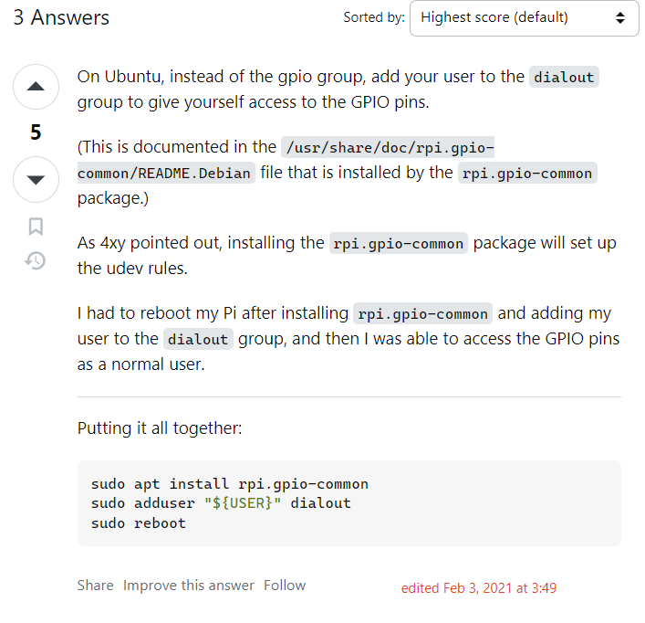

# Method 1 which worked

https://askubuntu.com/questions/1230947/gpio-for-raspberry-pi-gpio-group

## Method2: 

https://raspberrypi.stackexchange.com/questions/40105/access-gpio-pins-without-root-no-access-to-dev-mem-try-running-as-root

## Additional

https://techoverflow.net/2019/12/12/how-to-fix-raspberry-pi-gpio-no-access-to-dev-mem-try-running-as-root/

https://www.etechnophiles.com/rpi-zero-2w-board-layout-pinout-specs-price/

https://sourceforge.net/p/raspberry-gpio-python/wiki/BasicUsage/